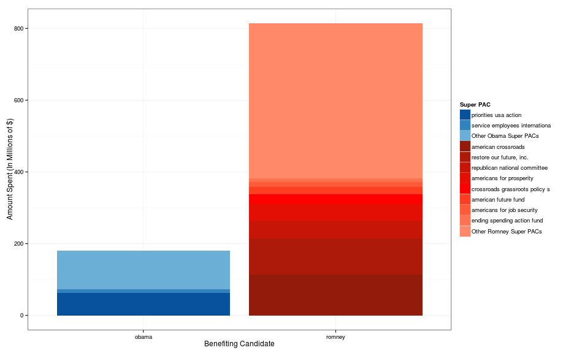
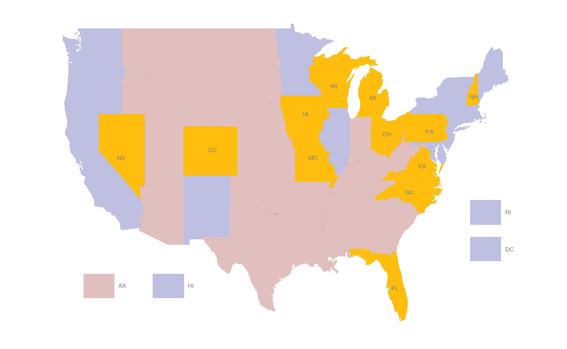
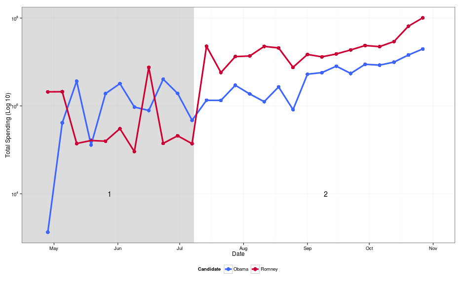
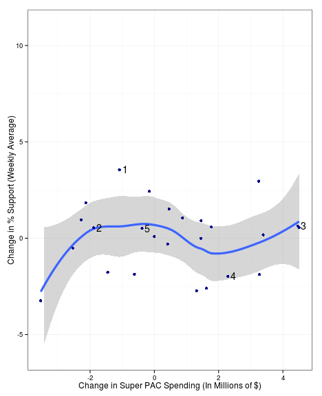
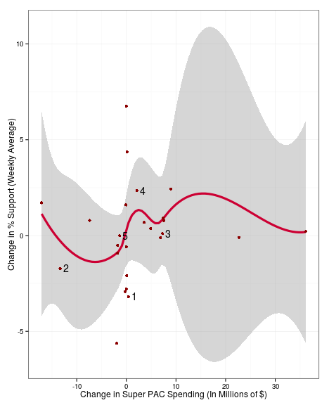
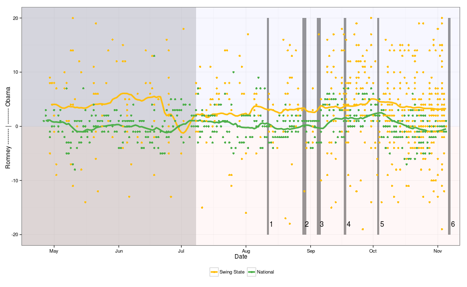

## Story of Our Lives...
</img>


---

## Motivation
> - 2010 Supreme Court Ruling: Citizens United
> - PAC - Any organization in the United States that campaigns for or against a candidate, ballot initiatives or legislation
> - Super PACs - A PAC to which corporations, unions, and other organizations can donate freely
> - How did this impact the 2012 election?

---

## Data
> - Independent Expenditures (FEC)
> - National/State Polling (Nationalpolls.com)

---

## Spending Data

```r
tail(spend.data, n = 2)
```

```
##        can_id       can_nam    spe_id              spe_nam ele_typ
## 110107        obama, barack c90013863 working for michigan       g
## 110108        obama, barack c90013863 working for michigan       g
##        can_off_sta can_off_dis can_off can_par_aff exp_amo    exp_dat
## 110107                       0       p               80000 2012-10-20
## 110108                       0       p                3060 2012-10-20
##        agg_amo sup_opp                                             pur
## 110107  109012 support             canvass outreach - began 10/20/2012
## 110108  109012 support literature distributed via canvass - 10/22/2012
##                       pay file_num amn_ind     tra_id   ima_num    rec_dat
## 110107   field strategies   822630       n f57.000001 1.296e+10 2012-10-20
## 110108 mack crounse group   822630       n f57.000002 1.296e+10 2012-10-20
##        prev_file_num  bucket        bucket2 oflag beneful_can
## 110107            NA canvass direct contact     1       obama
## 110108            NA canvass direct contact     1       obama
```


---

## Polling Data

```r
head(polls.data, n = 3)
```

```
##                    Pollster    State       Date Obama Romney isNational
## 1 Politico/GWU/Battleground National 2012-11-05    47     47       TRUE
## 2          Gravis Marketing     Ohio 2012-11-05    49     48      FALSE
## 3          Gravis Marketing  Florida 2012-11-05    49     49      FALSE
##   Obama.Romney
## 1            0
## 2            1
## 3            0
```


---

## Cleanup
**Bucket List**
> - **Ads** - Advertisement spending, including television, radio, and online
> - **Direct Contact** - Direct voter contact, such as canvassing
> - **Overhead** - Expenditures related to the ongoing cost of running a Super PAC, including salary, rent, consultants, fundraising, and travel
> - **Swag** - Clothing, signs, and other promotional material
> - **Other** - All expenses that do not fit into the above categories

---

## Spending by Independent Organization
 

---

## Map of Swing States
 

---

## Swing State Trends
 

---

## Types of Spending by Week
 

---

## Spending by Week
 

---

## Change in Polling over Spending
  

---

## Effect of Spending on Polls
 

---

## Conclusions/Future Work
> - Effect of Super PACs difficult to measure
> - Romney Super PACs spent more than Obama Super PACs
> - Obama's polling stronger in swing states
> - [Future Work] Candidate spending
> - [Future Work] Fully explore usability of expense purpose data

---

## Questions?
Eric Hare, erichare@iastate.edu<br>
Andee Kaplan, ajkaplan@iastate.edu<br><br><br>

## Acknowledgements
Prof. Dianne Cook<br>
Prof. Heike Hofmann<br>
Susan VanderPlas
