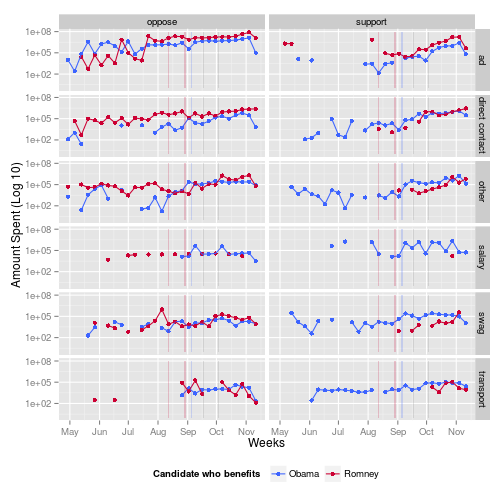

% A Look at the 2012 Election
% Eric Hare & Andee Kaplan
% Dec. 6th 2012


#


# Motivation
- 2010 Supreme Court Ruling: Citizens United
- Super PACs

## How did this impact the 2012 election?

# Data
- Independent Expenditures (FEC)
- National/State Polling (Nationalpolls.com)


```r
head(spend.data, n = 3)
```

```
##   can_id       can_nam    spe_id
## 5        obama, barack c00348540
## 6        obama, barack c00348540
## 7        obama, barack c00348540
##                                                            spe_nam ele_typ
## 5 1199 service employees int'l union federal political action fund       g
## 6 1199 service employees int'l union federal political action fund       g
## 7 1199 service employees int'l union federal political action fund       g
##   can_off_sta can_off_dis can_off can_par_aff exp_amo    exp_dat agg_amo
## 5          fl           0       p              188589 2012-09-12  188589
## 6          pa           0       p               18904 2012-09-12   18904
## 7          fl           0       p               20006 2012-08-08   20006
##   sup_opp                                   pur
## 5 support reimburse staff salaries and benefits
## 6 support reimburse staff salaries and benefits
## 7 support reimburse staff salaries and benefits
##                                        pay file_num amn_ind   tra_id
## 5 1199 seiu united healthcare workers east   809454       n se.10744
## 6 1199 seiu united healthcare workers east   809454       n se.10742
## 7 1199 seiu united healthcare workers east   803862       n se.10722
##     ima_num    rec_dat prev_file_num bucket bucket2 oflag beneful_can
## 5 1.295e+10 2012-09-13            NA salary  salary     1       obama
## 6 1.295e+10 2012-09-13            NA salary  salary     1       obama
## 7 1.297e+10 2012-08-10            NA salary  salary     1       obama
```

```r
head(polls.data, n = 3)
```

```
##                    Pollster    State       Date Obama Romney isNational
## 1 Politico/GWU/Battleground National 2012-11-05    47     47       TRUE
## 2          Gravis Marketing     Ohio 2012-11-05    49     48      FALSE
## 3          Gravis Marketing  Florida 2012-11-05    49     49      FALSE
##   Obama.Romney
## 1            0
## 2            1
## 3            0
```


# Cleanup
## Bucket List
- **Ads** Advertisement spending, including television, radio, and online
- **Direct Contact** Direct voter contact, such as canvassing
- **Salary** Payments made to staff of the organization
- **Swag** Clothing, signs, and other promotional material
- **Transport** Transportation costs, such as taxis or van rentals
- **Other** All expenses that do not fit into the above categories

# Types of Spending by Week

 


# Spending Categories
  


# Spending by Independent Organization
 


# Swing State Trends
 


# Spending by Week
 


# Effect of Spending on Polls
 


# Conclusions/Future Work
- Effect of Super PACs difficult to measure
- Romney Super PACs spent more than Obama Super PACs
- Obama's polling stronger in swing states
- _Future Work_ Candidate spending
- _Future Work_ Fully explore usability of expense purpose data
